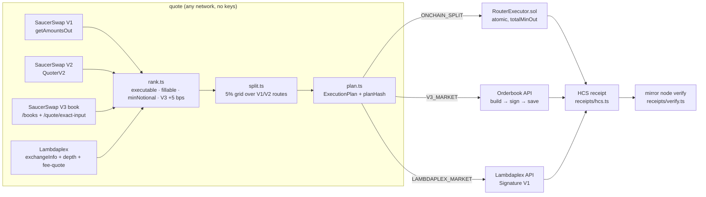

# Hedera Smart Order Router

**Quote SaucerSwap V1, V2, the V3 order book and Lambdaplex, split across V1/V2 pools, execute on whichever venue (or split) gives the best output, publish a best-execution receipt to HCS, and verify it from the mirror node.** A Scaffold-HBAR template.

SaucerSwap's own router ["is part of the SaucerSwap app and is not exposed as a public API"](https://docs.saucerswap.finance/protocol/routing), so every integrator has to quote each venue by hand and usually picks one. This template is that routing layer as open code: one call returns every venue's executable price, a split plan that is never worse than the best single venue, and one execution path per venue kind.

## 60-second demo (no keys, no wallet)

```bash
npm create scaffold-hbar@latest my-router -- --template big14way/router --frontend nextjs-app --solidity-framework hardhat --network testnet --package-manager yarn
cd my-router
yarn sdk:quote --net testnet --in WHBAR --out SAUCE --amount 10     # every venue, from the terminal
yarn sdk:plan  --net mainnet --in SAUCE --out USDC  --amount 5000   # read-only plan on mainnet
yarn next:dev                                                       # http://localhost:3000 → venue table + plan
```

Mainnet quoting is read-only by default. Nothing here moves funds until you deploy, fund an account and opt in (see [Mainnet execution](#mainnet-execution-walkthrough)).

## What's inside

| Package | What it does |
|---|---|
| `packages/router-sdk` | TypeScript SDK: venue adapters (`SaucerV1`, `SaucerV2`, `SaucerV3`, `Lambdaplex`), ranker, grid-search splitter, planner, HCS receipts, mirror-node verification, `sdk:quote` / `sdk:plan` CLIs |
| `packages/hardhat` | `RouterExecutor.sol` (atomic V1/V2 split with per-leg and total `minOut`, HBAR in/out, HTS self-association), mocks, tests, deploy script |
| `packages/nextjs` | `/` quotes with no wallet, `/swap` executes the plan, `/orders` V3 order tracking, `/receipts/[id]` verification, `/docs` |
| `scripts/` | `gate-check.mjs` (the bounty gate), `create-topic.ts`, `seed-testnet.ts`, V3 onboarding / place-and-cancel |
| `docs/` | architecture, venues, Hedera gotchas, references read, deviations, testnet and mainnet evidence |

## Architecture



The SDK is the only place that knows venues. The app's API routes call it server-side (bot keys never reach the browser); the CLIs call it directly; `RouterExecutor` is the only contract.

## Venues

Status checked live on 2 Oct 2026; the router re-reads every flag at quote time.

| Venue | Quote | Execute | Networks | Live status (2 Oct 2026) |
|---|---|---|---|---|
| SaucerSwap V1 | `RouterV3.getAmountsOut` via `eth_call`, direct + via-WHBAR paths | `RouterExecutor` → `swapExactTokensForTokens` / `swapExactETHForTokens` | testnet, mainnet | pairs WHBAR/SAUCE, WHBAR/USDC, SAUCE/USDC live on both |
| SaucerSwap V2 | `Factory.getPool` per fee tier + `QuoterV2.quoteExactInput`, direct + two-hop | `RouterExecutor` → `SwapRouter.exactInput` (+ `refundETH` for HBAR) | testnet, mainnet | testnet: 0.30 % pools only; mainnet quoter needs a fallback relay ([D-4](docs/DEVIATIONS.md)) |
| SaucerSwap V3 order book | `GET /books` (OPEN, not halted) + `GET /books/:id/quote/exact-input`; taker fee from the book | signed MARKET order with `isAMMEnabled:true` (build → sign → save → track → cancel) | testnet, mainnet | testnet: only book 3 SAUCE/USDC is OPEN and it is **halted**; mainnet: 5 open books, min notional 15 USDC |
| Lambdaplex | `exchangeInfo` + `depth` walk (public); `fee-quote` when keyed | Signature V1 API (keyed) | mainnet only | 13 symbols TRADING; execution not enabled in this build (quote-only) |

Selection rules mirror SaucerSwap's app: a venue must be executable right now, the quote must fill the whole size and clear the venue's minimum notional, V3 wins only when it beats the best AMM by ≥ 5 bps, and Lambdaplex competes with its taker fee already deducted. See [docs/VENUES.md](docs/VENUES.md).

## Testnet walkthrough

Everything below is reproducible with a faucet account. Addresses and transaction links from our run are in [docs/TESTNET-EVIDENCE.md](docs/TESTNET-EVIDENCE.md).

1. **Create and fund a deployer.** Either `yarn hardhat:account:generate` (encrypted key, interactive deploy) or put a plain ECDSA key in the root `.env` as `DEPLOYER_PRIVATE_KEY` (non-interactive). Fund the EVM address at <https://portal.hedera.com/faucet>; the first transfer auto-creates the account (HIP-32). Budget about 200 HBAR for the whole walkthrough.
2. **Deploy RouterExecutor.** `yarn hardhat:deploy --network hederaTestnet` prints the HashScan link and `NEXT_PUBLIC_ROUTER_EXECUTOR=0x…`; copy it into `.env`. Optional: `yarn hardhat:verify -- RouterExecutor testnet`.
3. **Create the receipts topic.** Put the account's `0.0.x` ID and key in `.env` as `HEDERA_OPERATOR_ID` / `HEDERA_OPERATOR_KEY`, then `yarn topic:create` → `NEXT_PUBLIC_RECEIPTS_TOPIC_ID=0.0.y`.
4. **Seed demo liquidity (optional but recommended).** `yarn seed:testnet` creates two HTS tokens, a V1 pair and a V2 pool with deliberately different prices so a split beats either venue, and prints `NEXT_PUBLIC_EXTRA_TOKENS=TKA:0.0.a:8,TKB:0.0.b:8` for `.env`.
5. **Plan.** `yarn sdk:plan --net testnet --in TKA --out TKB --amount 1000` shows the split and the gain over the best single venue.
6. **Execute.** From the terminal, `yarn execute:plan --net testnet --in HBAR --out SAUCE --amount 1` plans, runs the pre-flight, executes through `RouterExecutor`, publishes the receipt and verifies it in one go (this is how the evidence below was produced). In the browser, `yarn next:dev`, open `/swap`, connect a wallet on Hedera testnet (chain 296), pick the pair. The page runs the pre-flight (associate the output token with one click, approve `RouterExecutor`), then executes `executeSplit` atomically. HBAR input is sent as `msg.value`.
7. **Verify.** The success panel links to HashScan and to `/receipts/<sequence>`, where the receipt is read back from the mirror node and matched against the `RouteExecuted` log's `planHash`.

## Mainnet execution walkthrough

Quoting mainnet needs nothing. Executing on mainnet is opt-in and capped:

| Flag | Effect |
|---|---|
| `ALLOW_MAINNET_EXECUTION=true` | required by every code path that can move real funds (`/swap`, receipt publishing, V3 placement); default `false` |
| `MAINNET_MAX_NOTIONAL_USD` | per-order cap, default 20 USD |

With the flags set, deploy `RouterExecutor` with `yarn hardhat:deploy --network hederaMainnet`, create a topic with `yarn topic:create --net mainnet`, and use `/swap` exactly as on testnet. See [docs/MAINNET-EVIDENCE.md](docs/MAINNET-EVIDENCE.md) for what was and was not run.

### SaucerSwap V3 orders (any network)

The V3 path is a signed-order flow, not a contract call: authenticate (challenge → Hedera personal-sign → JWT), onboard the account (associate both tokens, approve Permit2, approve the reactor inside Permit2), quote, `POST /orders/build`, sign the *returned* struct (EIP-712 against the runtime `GET /signature/domain`, mode byte `0x00`), `POST /orders/save`, track `/ws/user-events` or `GET /orders/:id/history`, cancel with `POST /cancel`.

```bash
yarn v3:onboard --net testnet --book 3                     # bot account: run every missing onboarding step, re-verified on chain
yarn v3:place-and-cancel --net testnet --book 3 --input base --amount 10000000 --factor 10   # resting limit far from market, then cancel
```

The bot is `V3_BOT_ACCOUNT_ID` / `V3_BOT_PRIVATE_KEY` (falls back to the deployer key). With a bot configured, `/swap` places V3 market orders server-side and `/orders` lists and cancels them; wallet users get one-click onboarding transactions and the `0x01` personal-sign payload (see [D-9](docs/DEVIATIONS.md)). On 3 Oct 2026 testnet book 3 was halted: build and signature succeeded, `POST /orders/save` answered `Orderbook 3 is currently halted` — recorded verbatim in [docs/TESTNET-EVIDENCE.md](docs/TESTNET-EVIDENCE.md).

## Environment variables

The CLI writes `.env.example` from `template.json`; copy it to `.env` in the repo root (Hardhat, the SDK scripts and Next.js all read it). Only `.env.example` is tracked.

| Variable | File | Public / server | Purpose |
|---|---|---|---|
| `DEPLOYER_PRIVATE_KEY` | `.env` | server | ECDSA key that deploys `RouterExecutor` and seeds liquidity (alternative: `yarn hardhat:account:generate`) |
| `HEDERA_OPERATOR_ID`, `HEDERA_OPERATOR_KEY` | `.env` | server | creates the HCS topic and submits receipts |
| `NEXT_PUBLIC_ROUTER_EXECUTOR` | `.env` | public | deployed `RouterExecutor` address the app executes through |
| `NEXT_PUBLIC_RECEIPTS_TOPIC_ID` | `.env` | public | HCS topic receipts are published to and verified from |
| `NEXT_PUBLIC_EXTRA_TOKENS` | `.env` | public | extra HTS tokens for the pickers, `SYM:0.0.id:decimals,…` (printed by `seed:testnet`) |
| `V3_BOT_ACCOUNT_ID`, `V3_BOT_PRIVATE_KEY`, `V3_BOT_KEY_TYPE` | `.env` | server | optional bot that authenticates to the V3 API and signs orders with mode `0x00` (`V3_BOT_KEY_TYPE=ED25519` for raw-hex ED25519 keys) |
| `ALLOW_MAINNET_EXECUTION`, `MAINNET_MAX_NOTIONAL_USD` | `.env` | server | mainnet guard rails (above) |
| `LAMBDAPLEX_API_KEY`, `LAMBDAPLEX_ED25519_SEED` | `.env` | server | optional Lambdaplex key; enables the venue's own fee quote |
| `NEXT_PUBLIC_HEDERA_TESTNET_RPC_URL`, `NEXT_PUBLIC_HEDERA_MAINNET_RPC_URL`, `HEDERA_FALLBACK_RPC_URLS` | `.env` | public | override the JSON-RPC relays (public ones are rate limited) |
| `NEXT_PUBLIC_WALLET_CONNECT_PROJECT_ID` | `packages/nextjs/.env` | public | WalletConnect project for RainbowKit |

## Hedera gotchas this template handles

Short version; the full list with the checks behind each item is in [docs/HEDERA-GOTCHAS.md](docs/HEDERA-GOTCHAS.md).

- **HBAR has 8 decimals in the EVM and 18 at the JSON-RPC relay.** `units.ts` is the only place that converts; `tinybarToWeibar` goes into `value`, everything else stays in 8 or token decimals. Verified on Hashio: 1 tinybar = 10¹⁰ weibar.
- **Association before transfer.** `RouterExecutor` associates itself through the HTS system contract (`0x167`, codes 22/23) and caches it; `/swap` associates the user through the HIP-719 `associate()` facade.
- **Never touch the WHBAR contract directly.** Unwraps go through `WhbarHelper`; paths use the WHBAR *token* address.
- **Gas.** HIP-1249 removed the minimum charge; unused gas is refunded. Limits are still set realistically.
- **Public relays are rate limited and refuse some simulations.** `ethCall` fails over relay → fallback relays → mirror node `/contracts/call`.
- **Testnet prices are not real.** Labelled "demo liquidity" everywhere.

## Testing, CI and the bounty gate

```bash
yarn lint                 # next, hardhat and sdk, zero warnings
yarn sdk:test:coverage    # vitest with mocked HTTP/RPC, ≥ 90 % lines on the SDK
yarn hardhat:test         # RouterExecutor against mocks, offline, 100 % statements/lines
yarn next:build
node scripts/gate-check.mjs --local   # scaffold this checkout with create-scaffold-hbar, install, lint, test, build, boot, curl every route
```

`.github/workflows/ci.yml` runs all of that plus `gitleaks` on every push. `scripts/gate-check.mjs` without `--local` scaffolds from GitHub, which is exactly what judges run.

## Limitations

- Testnet V3 books are closed or halted (checked 2–3 Oct 2026): onboarding completed and a signed order was built, but `POST /orders/save` refuses the halted book, so a testnet V3 fill cannot be demonstrated. Mainnet V3 execution is implemented but was not run (no mainnet funds).
- V3 wallet signing (`0x01`) is prepared (payload + SignatureMap) but the template's EVM wallet stack has no Hedera WalletConnect session; bot signing (`0x00`) is what the app uses.
- Lambdaplex is mainnet-only and keyed; this build quotes it (public depth, keyed fee-quote) but does not place orders.
- Mainnet execution was not exercised in this submission (no mainnet funds); the code paths are implemented and unit-tested, and guarded by the flags above.
- `RouterExecutor` is small and tested but not audited. Do not point real size at it.

## Evidence

- [docs/TESTNET-EVIDENCE.md](docs/TESTNET-EVIDENCE.md): RouterExecutor address, seeded tokens/pools, the split-swap transaction (HashScan + mirror), the HCS topic and receipt message, the V3 testnet attempt.
- [docs/MAINNET-EVIDENCE.md](docs/MAINNET-EVIDENCE.md): read-only mainnet quotes and what was not run.
- [docs/REFERENCES.md](docs/REFERENCES.md): every doc page read, with the facts taken from it; [docs/DEVIATIONS.md](docs/DEVIATIONS.md): where live docs or behaviour differed from the build spec.

## Licence

MIT. Built on the [Scaffold-HBAR](https://github.com/hedera-dev/scaffold-hbar) blank template (MIT, hedera-dev and BuidlGuidl).
